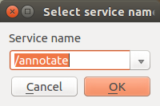
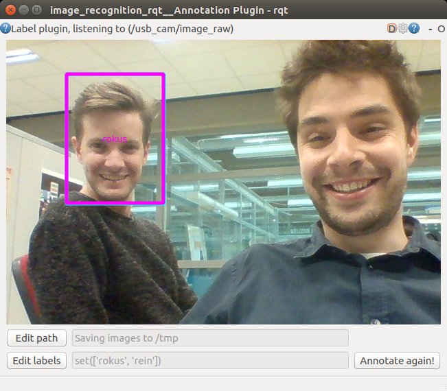
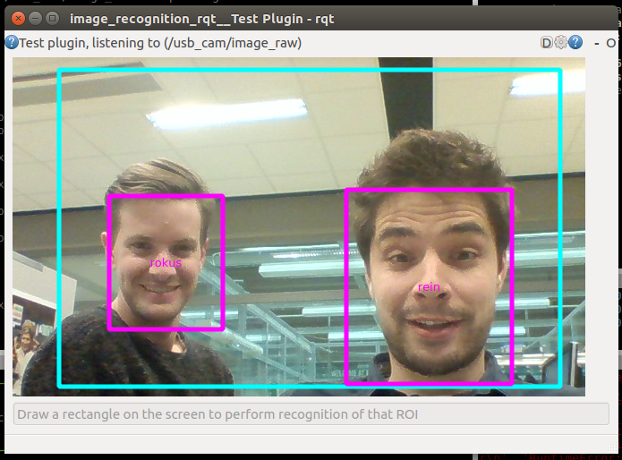

# image_recognition_face_recognition

TO DO

Face recognition with use of Facenet (<https://github.com/timesler/facenet-pytorch/tree/master>)
Paper can be found: [paper](https://arxiv.org/pdf/1503.03832.pdf)

## Installation

See <https://github.com/tue-robotics/image_recognition>

Make sure you have installed **CUDA8**.

bash commends will be available when merged

## How-to

### Run Face Recognition Node

Run the command why using your camera as an input (use roscamera node):

    rosrun cv_camera cv_camera_node
    rosrun image_recognition_face_recognition face_recognition_node image:=/cv_camera/image_raw 

### ROS Node

Run the image_recognition_face_detection node in one terminal:

    rosrun image_recognition_face_detection face_recognition_node

Run the rqt annotation client (<https://github.com/tue-robotics/image_recognition_rqt>)

    rosrun image_recognition_rqt annotation_gui

Setup the service by clicking the gear wheel in the top-right corner. Select the `/annotate` services exposed by the openface ros node. Also don't forget to set-up your labels.

Now draw a rectangle around the face you would like to learn. The face recognizer will find the biggest face in the image and store a representation for this face.

Now select the label and you will see that the openface ros node stores the face (console output node):

    [INFO] [WallTime: 1478636380.407308] Succesfully learned face of 'rokus'

Learn as many faces as you want ..

Next step is starting the image_recognition_Rqt test gui (<https://github.com/tue-robotics/image_recognition_rqt>)

    rosrun image_recognition_rqt test_gui

Again configure the service you want to call with the gear-wheel in the top-right corner of the screen. If everything is set-up, draw a rectangle in the image and ask the service for detections:

You will see that the result of the detection will prompt in a dialog combo box. Also the detections will be drawn on the image.

### Command line

Command line interface to test the detection / recognition based on an image:

    usage: get_face_recognition IMAGE [-k ALIGN_PATH] [-s NET_PATH] [-v]

Run the command on an example image:

    rosrun image_recognition_face_recognition get_face_recognition `rospack find image_recognition_face_recognition`/doc/example.png

