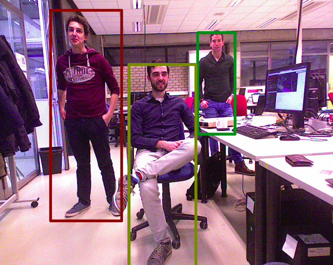

image_recognition_jetson
====================================

ROS Wrapper for Jetson inference https://github.com/dusty-nv/jetson-inference

## Description
Provides a service and topic interface for jetson inference. For now only the detect nets

### Some illustrations (pednet, bottlenet, facenet)

## Installation on Jetson TX2

Run the install jetson-inference script

    rosrun image_recognition_jetson install_jetson_inference.bash 

If the jetson-inference cannot be found using CMake, it will compile a mock.

