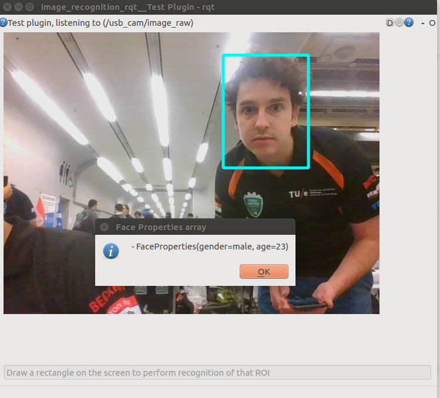

# Keras image recognition

Image recognition with use of Keras.

## Installation

See https://github.com/tue-robotics/image_recognition for installation instructions.

## ROS Node (face_properties_node)

Age and gender estimation with use of WideResNet from https://github.com/yu4u/age-gender-estimation. You can download the pre-trained model here: https://github.com/tue-robotics/image_recognition/releases/download/image_recognition_keras_face_properties_weights.28-3.73/image_recognition_keras_face_properties_weights.28-3.73.hdf5
```
rosrun image_recognition_keras face_properties_node _weights_file_path:=[path_to_model]
```

Run the image_recognition_rqt test gui (https://github.com/tue-robotics/image_recognition_rqt)

    rosrun image_recognition_rqt test_gui

Configure the service you want to call with the gear-wheel in the top-right corner of the screen. If everything is set-up, draw a rectangle in the image around a face:



## Scripts

### Get face properties (get_face_properties)

Get the classification result of an input image:

```
rosrun image_recognition_keras get_face_properties --image doc/face.png --weights-path [path_to_model]
```


Output:

    [(50.5418073660112, array([0.5845756 , 0.41542447], dtype=float32))]

## Troubleshooting

```
An error occurred: softmax() got an unexpected keyword argument 'axis'
```

Make sure you have tensorflow version >= 1.5.
