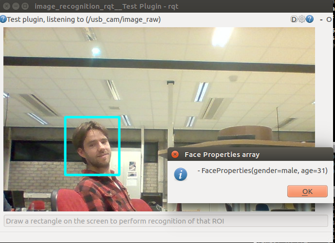

# Skybiometry image recognition

Obtain face properties of a face image using the Skybiometry API (https://skybiometry.com/)

## Installation

See https://github.com/tue-robotics/image_recognition

## How-to

### ROS Node

Run the skybiometry ros node in one terminal (Please specify your own api secret and key via ROS parameters):

    rosrun image_recognition_skybiometry face_properties_node

Run the image_recognition_rqt test gui (https://github.com/tue-robotics/image_recognition_rqt)

    rosrun image_recognition_rqt test_gui

Configure the service you want to call with the gear-wheel in the top-right corner of the screen. If everything is set-up, draw a rectangle in the image around a face:

You will see that the result of the detection will prompt in a dialog box.

### Command line

Command line interface to test the face properties based on an input face image:

    usage: get_face_recognition.py [-h] -i IMAGE [-k ALIGN_PATH] [-s NET_PATH] [-v]

Run the command on an example image:

    rosrun image_recognition_skybiometry get_face_properties.py -i `rospack find image_recognition_skybiometry`/doc/face.png

This will lookup this image in the image_recognition_skybiometry/doc folder and perform recognition

Output:

    [FaceProperties(age=[53, 0.5], eyes=[open, 0.95], gender=[male, 0.33], glasses=[false, 0.13], lips=[parted, 0.65], mood=[happy, 0.68])]
