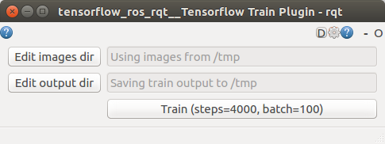

# tensorflow_ros_rqt

Contains rqt plugins for training a neural network for object recognition using TensorFlow.

## Train plugin

This RQT plugin (http://wiki.ros.org/rqt) enables training a neural network to classify objects based on images using TensorFlow. The end result will be a trained TensorFlow graph and output labels as in https://github.com/tensorflow/tensorflow/blob/master/tensorflow/examples/image_retraining/retrain.py

### How to 

#### Prerequisites

Annotated data with label subdirs that contain image segments of the specified label, e.g. `/tmp/object_recognition`:

    /tmp/object_recognition/:
    drwxrwxr-x 2 rein rein 4,0K okt 18 21:22 apple
    drwxrwxr-x 2 rein rein 4,0K okt 18 21:22 banana
    drwxrwxr-x 2 rein rein 4,0K okt 18 21:22 choco_peanuts

    /tmp/object_recognition/apple:
    -rw-rw-r-- 1 rein rein 14K okt 18 21:22 2016-10-18-21-22-29.jpg
    ...

    /tmp/object_recognition/banana:
    -rw-rw-r-- 1 rein rein 16K okt 18 21:22 2016-10-18-21-22-37.jpg
    ...

    /tmp/object_recognition/choco_peanuts:
    -rw-rw-r-- 1 rein rein 8,6K okt 18 21:22 2016-10-18-21-22-43.jpg
    ...
    
This labeled data set can be created with use of the label RQT plugin in the [image_recognition_rqt](https://github.com/tue-robotics/image_recognition/tree/master/image_recognition_rqt) package. But, feel free to use any kind of tooling to create your own data set!

#### Training

Start the train GUI

    rosrun tensorflow_ros_rqt train_gui 
    

Set the images and output directory. For the example above, use `/tmp/object_recognition` as images directory

and for example `/tmp` as output directory.

Click the gear wheel in the right top of the GUI to set the batch size and the number of steps:

Once everything is configured, press the "Train" button.

Wait for some hours :) -- Check console log. 

